# Heart Care App 🫀🩸❤️


### ⭐️ Features:

⚡️ Lets you sign up and login

⚡️ Montioring your heart failure risk and heart beat through charts

⚡️ View Medical History

⚡️ Add new records

⚡️ Calculate heart beat 💓

⚡️ Prediction of heart disease

⚡️ Firebase Push Notifications on daily 8 AM Morning


### ⭐️ What tech I used:

⚡️ Flutter

⚡️ Flutter Provider

⚡️ MongoDB Atlas

### ⭐️ Demo:

<div>

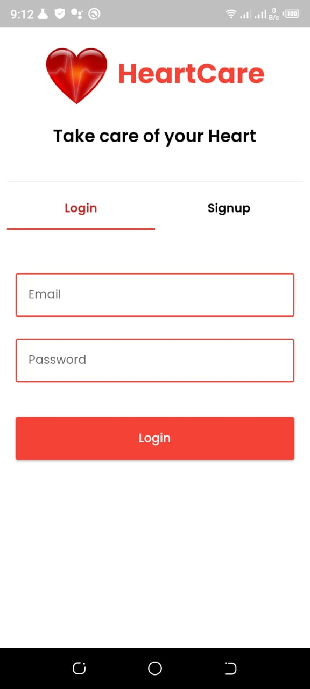
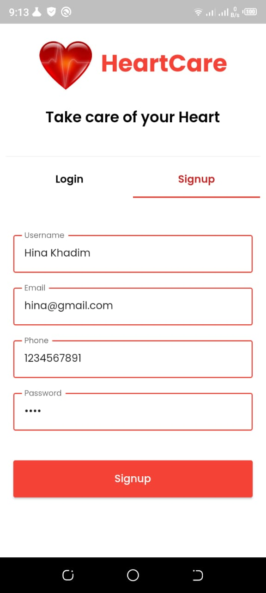
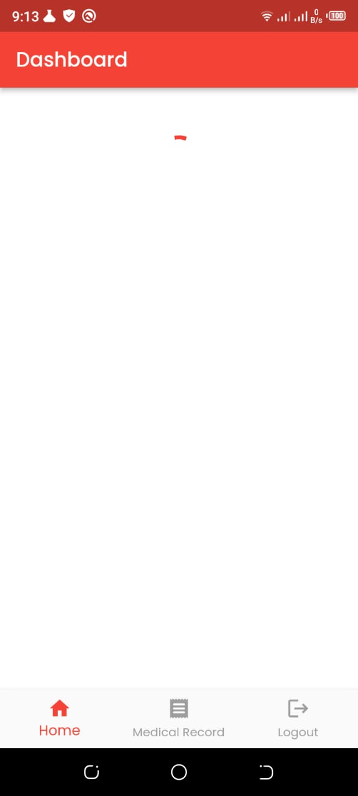

</div>
<hr />
<div style='margin-top: 40px;'>

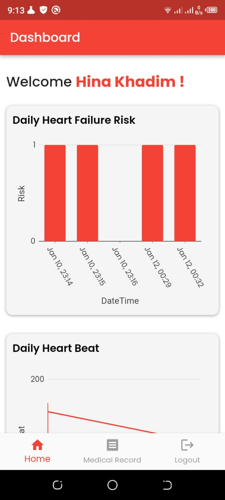
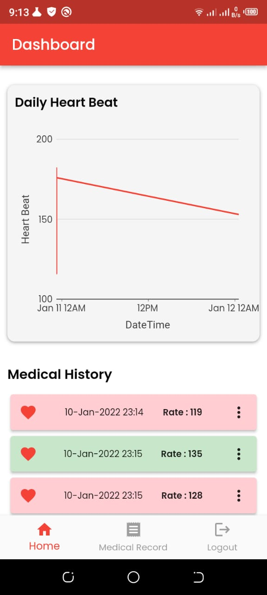
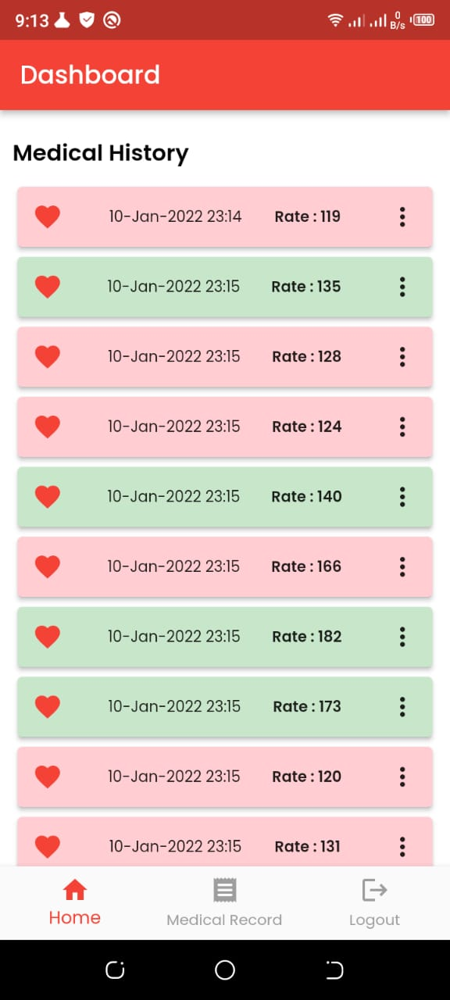

</div>
<hr />
<div  style='margin-top: 40px;'>

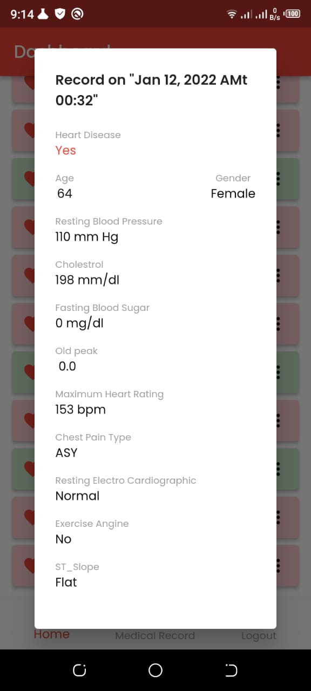
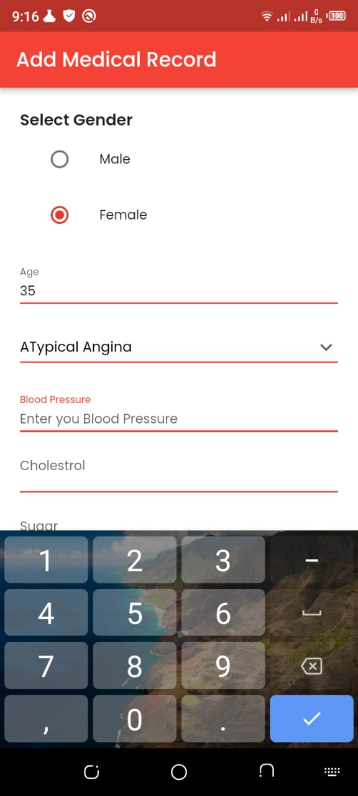
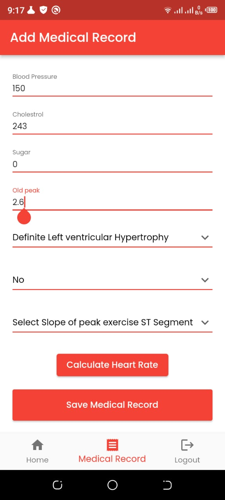

</div>
<hr />
<div  style='margin-top: 40px;'>

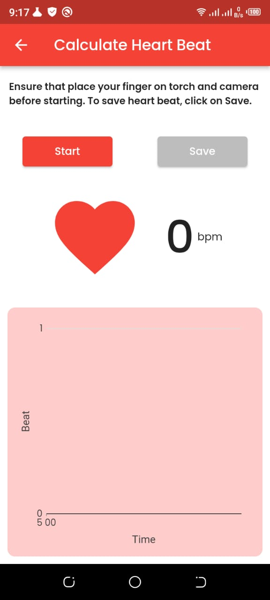
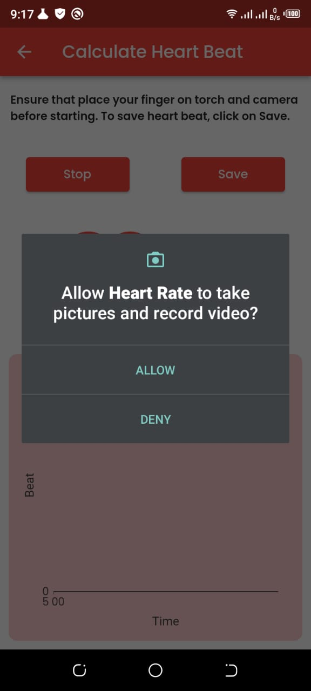
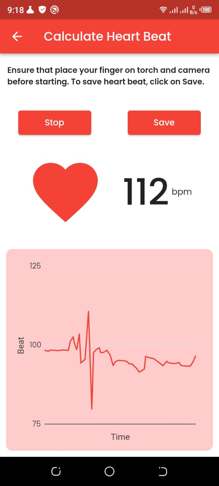

</div>
<hr />
<div  style='margin-top: 40px;'>


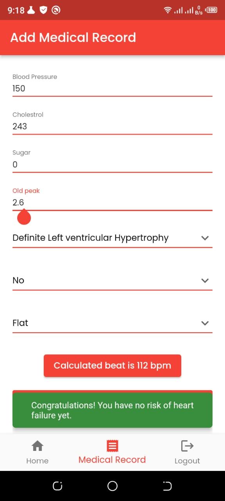

</div>

### ⭐️ Quick Start:

##### 1- Clone the Repo.

```
cd heart_rate_app/
flutter pub get
flutter run
```

Open the code and start customizing!

####  ⭐️ Want to contribute :
⚡️ Refactoring

⚡️ Validation

⚡️ Add more features

⚡️ Documentation

⚡️ Issues

⚡️ Pull Request


#### ⭐️ Backend 
**[Hina-softwareEngineer/heart_failure_backend](https://github.com/Hina-softwareEngineer/heart_failure_backend)**

#### ⭐️ ML Model
**[Hina-softwareEngineer/heart_failure_prediction](https://github.com/Hina-softwareEngineer/heart_failure_prediction)**

> ##### ⚡️ Give a 🌟🌟 if you liked it.


